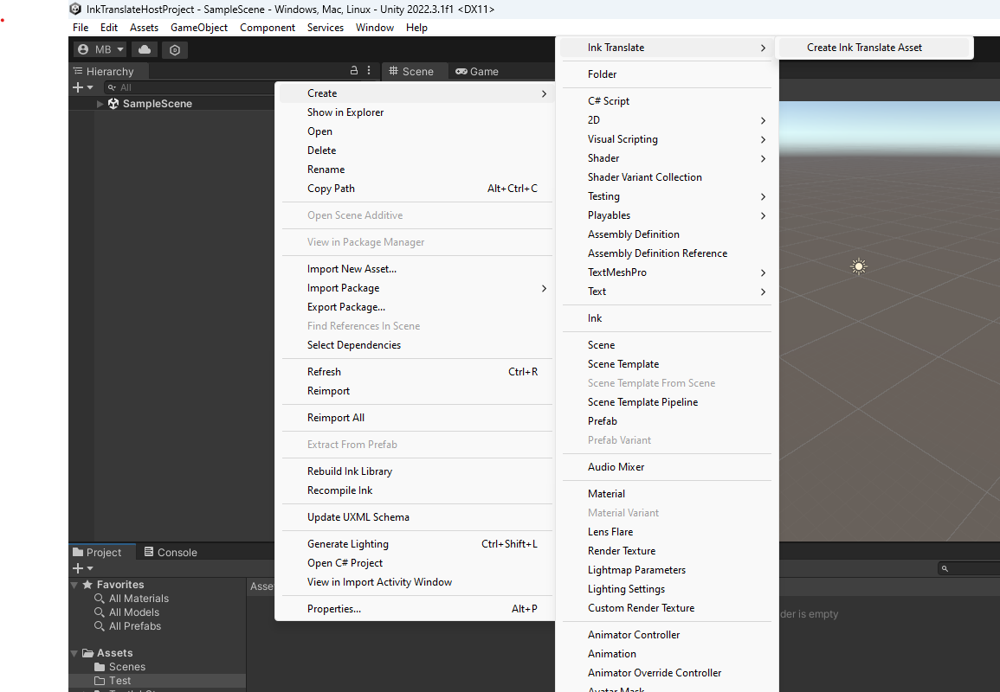
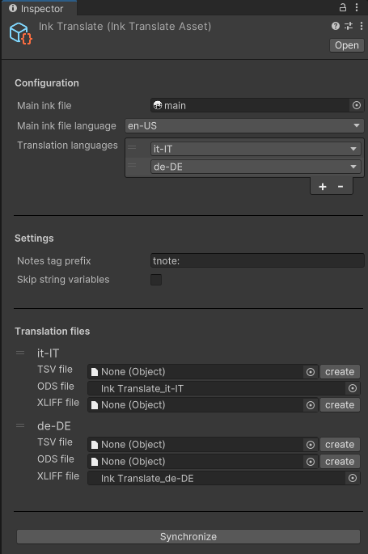
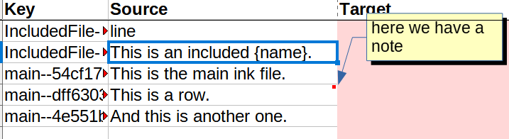
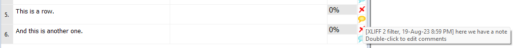

# :pencil2: Ink Translate

**Ink Translate** is a Unity package to handle the translation process of [ink projects](https://www.inklestudios.com/ink/).

This package is addressed to all sizes of studios, from the ones where a single person covers all the roles, to those with multiple writers, translators and programmers.

## Installation

1. The package is available on the [openupm registry](https://openupm.com). You can install it via [openupm-cli](https://github.com/openupm/openupm-cli).
```sh
openupm add it.lemurivolta.ink-translate
```
2. You can also install via git url by adding these entries in your **manifest.json**
```json
"com.inkle.ink-unity-integration": "https://github.com/inkle/ink-unity-integration.git#upm",
"it.lemurivolta.ink-translate": "https://github.com/lemurivolta/ink-translate#upm"
```

## System requirements

Ink Translate has been developed and tested on **Unity 2022.3.1**. Backward compatibility is possible but not tested.

# Overview

The general workflow for this tool consists of:

- **Package installation**. There are various ways to install the package, listed in [Installation](#installation).
- **Ink Translate Asset setup**. All the operations are performed on an _Ink Translate Asset_. The asset must be [created and configured](#configuration).
- **Translation process**. The translation process is _iterative_:
  1. the source ink project is created or updated by the writers
  1. a [synchronization operation](#sinchronization) is performed, and the translation files are created or updated with the text contents of the source ink project
  1. the updated translation files are sent to the translators
  1. the translators add and/or correct the translation files
  1. the translators send back the translation files
  1. the translation files are copied back into the project
  1. the synchronization operation is run again, producing or updating the translated ink projects.
  1. the process can be repeated until the source ink project file is no longer modified and no translations must be corrected

## Concepts

This package works by extracting data from a **source ink project**. This is the project where the writers work, and it's written in the _source language_ (e.g.: en-US).

The **Ink Translate Asset** is an asset that contains all the necessary configurations, and makes it possible to extract the text contents of the source ink project inside the **translation files**. These files start without any translated content, and are filled by the translators.

Once the translation files are compiled with the translations, the Ink Translate Asset is used again to produce a **translated ink project** for each configured _translation language_.

# Configuration

The configuration is performed through an _Ink Translate Asset_.

## Create the asset

Choose the folder where you want to create the asset in the **Project tab**, **right click** inside the folder space, and choose **Create**, **Ink Translate** and **Create Ink Translate Asset**.



## Asset configuration

The configuration is edited through the inspector of the Ink Translate Asset.



### Configuration

- **Main ink file** (_mandatory_): drag the main ink file of the source ink project here. _Note well_: this is the ink file, not the JSON file produced by the ink-unity integration.
- **Main ink file language**: The language in which the source ink project is written.
- **Translation languages**: The list of all languages to which this project will be translated.

### Settings

- **Notes tag prefix**: If present, then all the tags that start with this prefix will mark a [translation note](translation-notes) for the pertinent line. If empty, translation notes won't be generated.
- **Skip string variables**: Whether the strings that are expressions in ink code must be skipped or not. By default, they are included.

### Translation files

Every translation language will generate an entry in the _Translation files_ section. Here is where you can specify which translation files you want to use.

For each language you can specify up to three files, one for each format, that you want to use. You can create an empty file to start with using the "create" button next to them. This file won't contain any data until the first synchronization operation.

The supported formats are:

- **TSV** (_tab-separated values_): Like a CSV file, but using tabs as a separator. This is a very simple format of exchange, which almost any software can read. Translation notes are not supported in TSVs.
- **ODS**: The OpenDocument format for spreadsheet files. It's been tested _only_ with LibreOffice. It features notes, coloring of missing translations, and a sheet with reports of total translated and untranslated lines.
- **XLIFF** (_XML Localization Interchange File Format_): an XML-based format containing both source and target language created to standardize the way localizable data are passed between and among tools during a localization process. It supports notes too, and is the preferred format if the file is to be exchanged with CAT tools. It's been tested with memoQ.

The format to use can be chosen according to the needs of the translator.

# Synchronization

The Ink Translate Asset supports the synchronization between source ink project, translation files and translated ink projects just by using the button "Synchronize". The synchronization operation performs multiple operations, one after the other:

- It extracts all translatable strings from the source ink project
- It reads all the translations already present in the translation files
- It writes back the translation files, possibly adding new text to translate, but never removing existing data
- it writes the translated ink projects

Data is always added and never removed, except for the translated ink projects that are completely rewritten at each synchronize operation.

# Translation notes

Sometimes, notes must be added to the text in order to give the translators the necessary context to work. In order to do so, one can add notes through **tags** like these to the ink files:

```ink
This is the first line. #tnote:A note in the same line

#tnote:This note affects the next line
This is the second line.
```

The notes will be displayed in ODS files:



And also in XLIFF exports:

